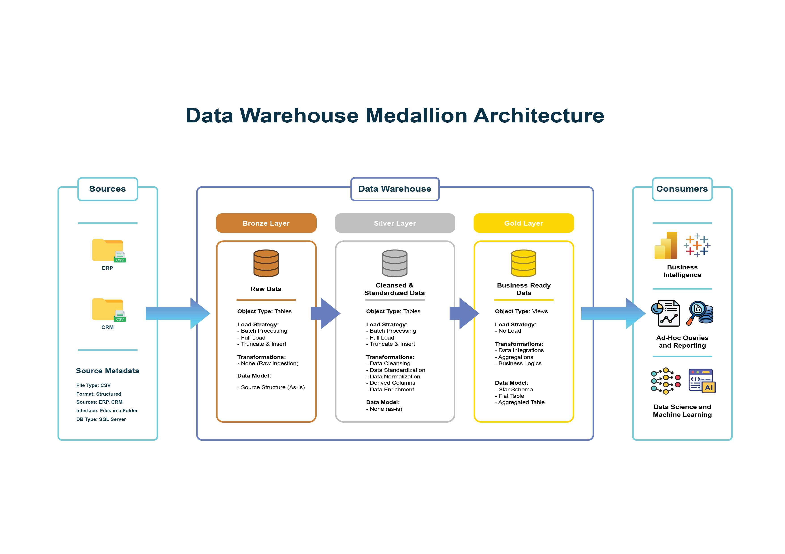
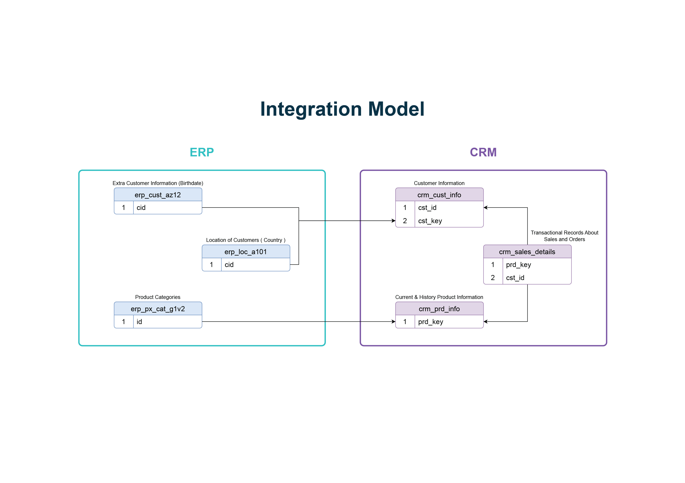
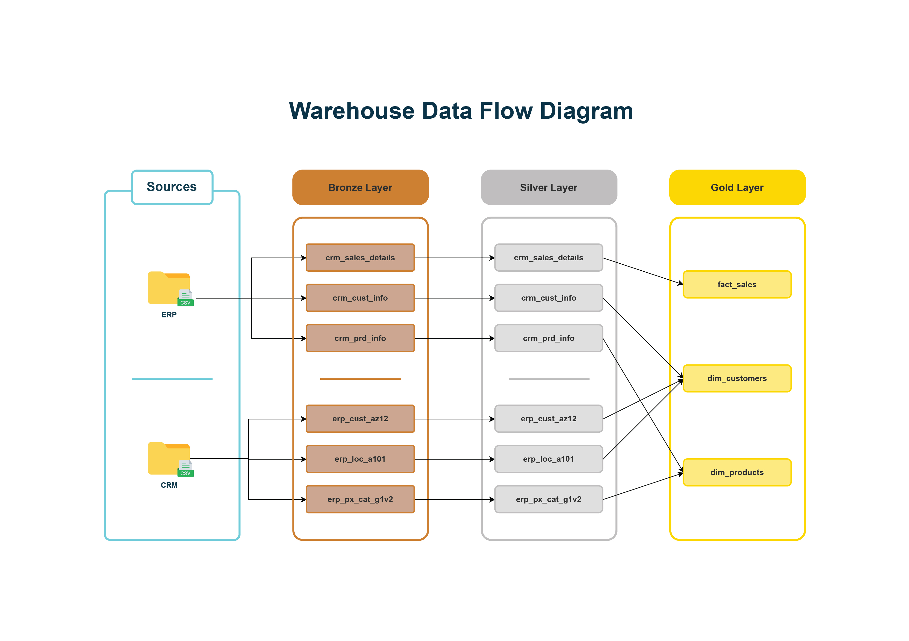
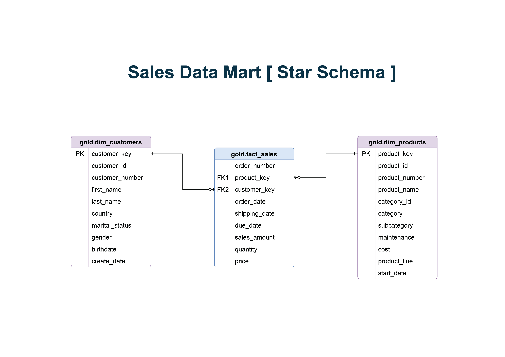

# SQL Medallion Architecture Data Warehouse (Full Project)

A comprehensive SQL Data Warehouse featuring a structured Medallion ETL pipeline and optimized data modeling to drive a full business intelligence analysis.

This project builds a modern data warehouse using SQL Server, consolidating sales data from two source systems (CRM and ERP) and modeling it into a clean, business-ready Star Schema for analytics and reporting.

---

## Data Architecture

The project follows the **Medallion Architecture**, structured into three layers:

- **Bronze Layer**: Stores raw, unprocessed data exactly as it comes from the source CSV files (CRM and ERP). Used for traceability and debugging.
- **Silver Layer**: Applies data cleansing, standardization, and normalization. This layer prepares data for analysis and resolves data quality issues found in the source systems.
- **Gold Layer**: Contains business-ready data, modeled into a Star Schema (dimension and fact views) for reporting and analytics.



---

## Data Integration Model

The warehouse consolidates two independent source systems, CRM and ERP, which share overlapping customers and products under different key formats. The Silver layer harmonizes these keys (e.g., aligning ERP `cid` with CRM `cst_key`) so the two systems can be joined reliably in the Gold layer.



---

## Data Flow

The diagram below traces the end-to-end movement of data, from the raw CRM and ERP source files, through the Bronze and Silver layers, into the final Gold layer views.



---

## Project Structure

```
data-warehouse-project/
│
├── datasets/                           # Raw datasets used for the project (ERP and CRM data)
│
├── docs/                               # Project documentation and architecture details
│   ├── architecture_decisions.md       # Architecture Decision Records (ADRs) explaining key design choices
│   ├── business_glossary.md            # Definitions of business terms used across the warehouse
│   ├── data_catalog.md                 # Catalog of Gold layer datasets, including field descriptions and metadata
│   ├── data_lineage.md                 # Traces how each Gold layer field is derived from source to final model
│   ├── data_warehouse_medallion_architecture_diagram.drawio  # Draw.io file showing the project's architecture
│   ├── data_warehouse_medallion_architecture_diagram.jpeg    # Exported image of the architecture diagram
│   ├── integration_model_diagram.drawio                      # Draw.io file for the source system integration model
│   ├── integration_model_diagram.jpeg                        # Exported image of the integration model diagram
│   ├── metadata.yaml                   # Machine-readable metadata catalog (sources, layers, PII, QA checks)
│   ├── naming-conventions.md           # Consistent naming guidelines for tables, columns, and files
│   ├── sales_data_mart_star_schema_diagram.drawio            # Draw.io file for the Gold layer star schema
│   ├── sales_data_mart_star_schema_diagram.jpeg              # Exported image of the star schema diagram
│   ├── warehouse_data_flow_diagram.drawio                    # Draw.io file for the end-to-end data flow
│   └── warehouse_data_flow_diagram.jpeg                      # Exported image of the data flow diagram
│
├── scripts/                            # SQL scripts for ETL and transformations
│   ├── init_database.sql               # Creates the DataWarehouse database and bronze/silver/gold schemas
│   ├── bronze/                         # Scripts for extracting and loading raw data
│   │   ├── ddl_bronze.sql              # Table creation for the Bronze layer
│   │   └── proc_load_bronze.sql        # Stored procedure to load raw CSVs into Bronze
│   ├── silver/                         # Scripts for cleaning and transforming data
│   │   ├── ddl_silver.sql              # Table creation for the Silver layer
│   │   └── proc_load_silver.sql        # Stored procedure to clean and load Bronze into Silver
│   ├── gold/                           # Scripts for creating analytical models
│       └── ddl_gold.sql                # View creation for the Gold layer (Star Schema)
│
├── tests/                              # Test scripts and quality files
│   ├── quality_checks_silver.sql       # Validation checks for the Silver layer
│   └── quality_checks_gold.sql         # Validation checks for the Gold layer
│
├── README.md                           # Project overview and instructions
├── LICENSE                             # License information for the repository
├── .gitignore                          # Files and directories to be ignored by Git
└── requirements.txt                    # Dependencies and requirements for the project
```

---

## Data Sources

| Source | Tables                                              |
|--------|------------------------------------------------------|
| CRM    | `cust_info`, `prd_info`, `sales_details`              |
| ERP    | `CUST_AZ12`, `LOC_A101`, `PX_CAT_G1V2`                |

---

## How to Run

1. **Initialize the database and schemas**
   Run `scripts/init_database.sql`. This drops and recreates the `DataWarehouse` database, and creates the `bronze`, `silver`, and `gold` schemas.

2. **Build and load the Bronze layer**
   Run `scripts/bronze/ddl_bronze.sql`, then execute:
   ```sql
   EXEC bronze.load_bronze;
   ```

3. **Build and load the Silver layer**
   Run `scripts/silver/ddl_silver.sql`, then execute:
   ```sql
   EXEC silver.load_silver;
   ```

4. **Build the Gold layer**
   Run `scripts/gold/ddl_gold.sql` to create the `gold.dim_customers`, `gold.dim_products`, and `gold.fact_sales` views.

5. **Validate the data**
   Run `tests/quality_checks_silver.sql` and `tests/quality_checks_gold.sql` to confirm data quality and referential integrity.

---

## Data Model (Star Schema)

The Gold layer is modeled as a Star Schema, with `gold.fact_sales` at the center, connected to `gold.dim_customers` and `gold.dim_products` through warehouse-generated surrogate keys.



---

## Naming Conventions

All database objects follow the standards defined in `docs/naming-conventions.md`, using `snake_case` throughout, with `<sourcesystem>_<entity>` for Bronze/Silver tables, `<category>_<entity>` for Gold tables/views, and `dwh_` prefixes for system-generated metadata columns.

---

## Documentation Index

| Document                                                        | Description                                                                 |
|-------------------------------------------------------------------|---------------------------------------------------------------------------------|
| [`docs/naming-conventions.md`](docs/naming-conventions.md)         | Naming rules for tables, columns, views, procedures, and files.                |
| [`docs/data_catalog.md`](docs/data_catalog.md)                     | Column-level catalog of the Gold layer views.                                   |
| [`docs/data_lineage.md`](docs/data_lineage.md)                     | Traces every Gold layer field back to its source file and transformation.       |
| [`docs/business_glossary.md`](docs/business_glossary.md)          | Plain-language definitions of business terms used across the warehouse.        |
| [`docs/architecture_decisions.md`](docs/architecture_decisions.md)| Architecture Decision Records explaining key design choices and trade-offs.     |
| [`docs/metadata.yaml`](docs/metadata.yaml)                        | Machine-readable metadata catalog (sources, layers, PII flags, QA checks).      |

---

## License

This project is licensed under the terms described in the `LICENSE` file.
